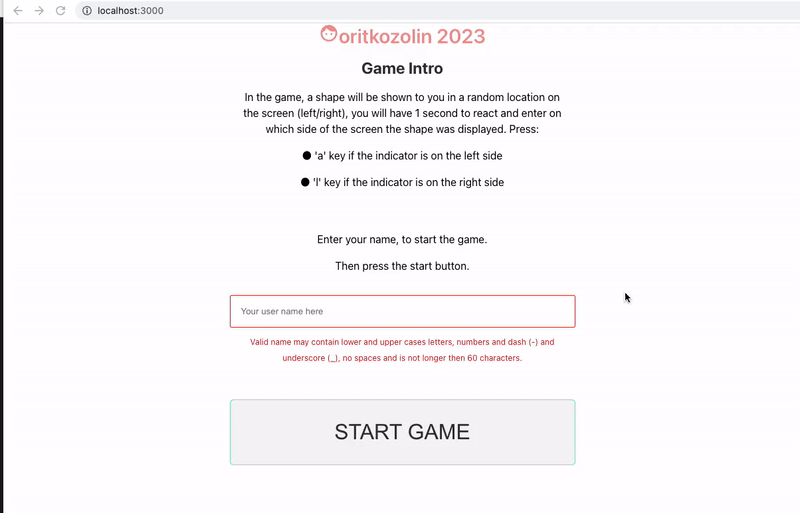
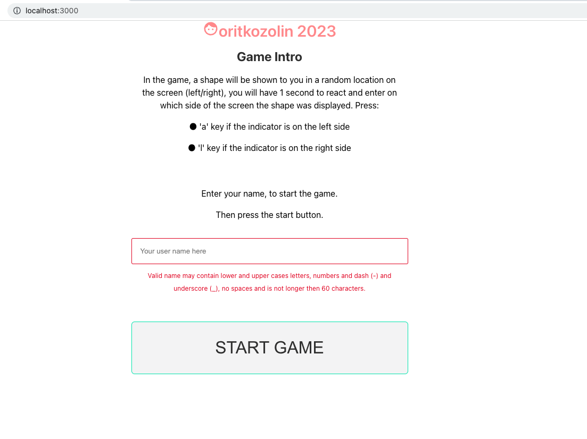
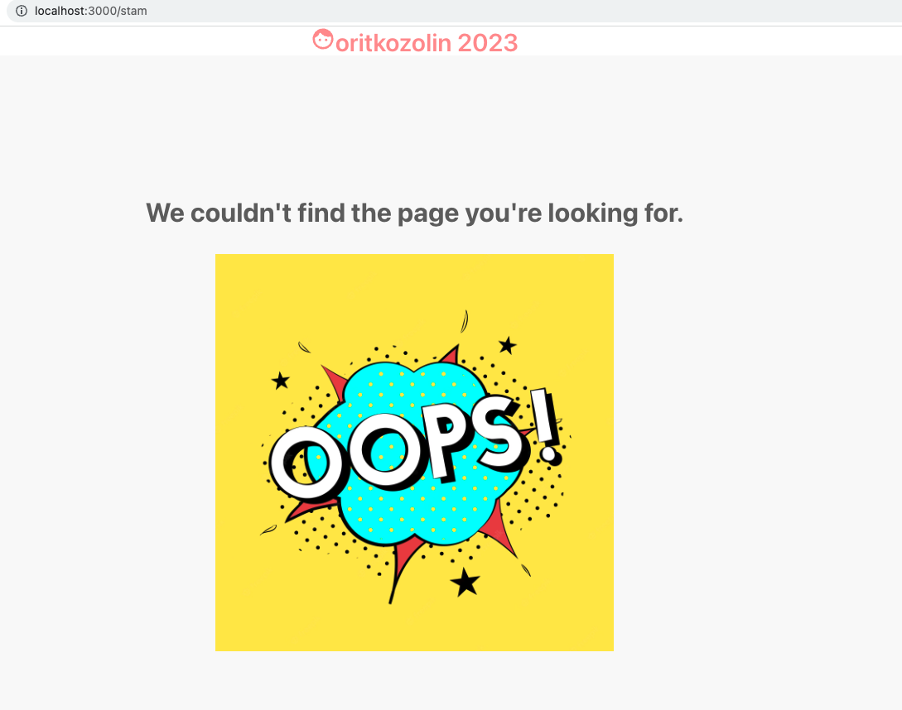
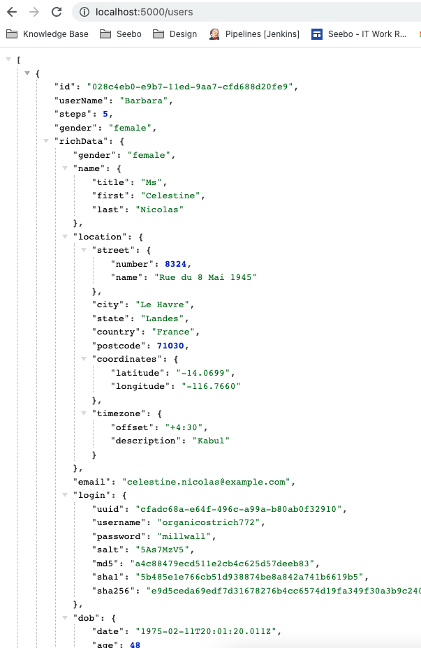

# Reaction-game
client server typescript project. implements decision making game

Stack: React + Typescript, styled_components, Node.js


## General
The game tests and provides feedback to the user on his reaction time and quick decision making.
In the game, a shape will be shown to the user in a random location on the screen (left/right),
the user will have 1 second to react and enter on which side of the screen the shape was displayed.
By the user's reaction, feedback will be displayed.
## Specification
### Client
The app starts with a page for inserting the user name and a ‘START’ button. 
The moment the user clicks ‘START’ the game loads in a waiting state. 



During the waiting state, the user is not supposed to do anything. 
This state lasts randomly between 2-5 seconds. 
After the waiting state, show the user an indicator on the left or right side of the screen. 
The indicator appears on the screen for 1 second. 
During the indicator is visible, the user is expected to tap the 'a' or 'l' key on the keyboard:

● 'a' if the indicator is on the left side

● 'l' if the indicator is on the right side. 

Going to unknown page will lead to this `NotFound` page:


#### States:

| User reaction                                             | State type | Message      |
| ---------------------------------------------------------- | ----------| ------------ |
| User taps any key in the waiting state                     | Mistake   | 'Too Soon'   |
| User taps an incorrect key in the indicator showing state  | Mistake   | 'Wrong Key'  |
| The indicator disappears before the user types any key     | Mistake   | 'Too Late'   |
| Correct key is tapped while the indicator is displayed     | Success   |              |


#### Finally
When there is a success or mistake, restart the game by going to the waiting state 
and at the sametime show feedback for the user at the bottom of the page until 
the new indicator is displayed.
The feedback should be a text (the error type) in red for mistakes and green for success. 

### Backend
Support a capability to show a leaderboard of results and work with API 
to enrich the data of the user.
For that, the user name and the number of steps he completed successfully are stored in a file.
In addition to storing the data from the game, enrich each user's data using two APIs:

● For each user name, we want to guess the gender using this API: Genderize.io|Determine the gender of a name. 
Only accept probability > 0.95. 
Otherwise, the genderis “undetermined”. 
Add this data to each row in the DB

● Once we have the genders, fetch some mock data (based on gender) for each user using Random User Generator API. 
Enrich each row with this data.

In addition to storing the data, create an endpoint returning the list of users sorted by the number of steps they reached. 
No UI for that.

We can see the list of sirted users by the number of stepd completed, with this url:

`localhost:5000/users`



## Getting Started
Git clone the project to your computer, and run

```bash
npm install
```
Run server and client from your terminal.
They are both configured to the ports specified below.
### Development mode

- For the Server

```bash
npm start
```

- For the Client

```bash
npm start
```

- ports

  Client: http://localhost:3000

  Server: http://localhost:5000